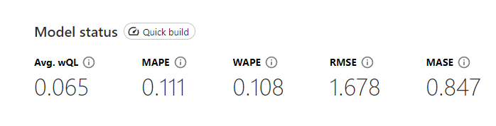

# 📊 Previsão de Estoque Inteligente na AWS com [SageMaker Canvas](https://aws.amazon.com/pt/sagemaker/canvas/)

Bem-vindo ao desafio de projeto "Previsão de Estoque Inteligente na AWS com SageMaker Canvas. Neste Lab DIO, você aprenderá a usar o SageMaker Canvas para criar previsões de estoque baseadas em Machine Learning (ML). Siga os passos abaixo para completar o desafio!

## 📋 Pré-requisitos

Antes de começar, certifique-se de ter uma conta na AWS. Se precisar de ajuda para criar sua conta, confira nosso repositório [AWS Cloud Quickstart](https://github.com/digitalinnovationone/aws-cloud-quickstart).

## 🎯 Objetivos Deste Desafio de Projeto (Lab)

- Dê um fork neste projeto e reescreva este `README.md`. Sinta-se à vontade para detalhar todo o processo de criação do seu Modelo de ML para uma "Previsão de Estoque Inteligente".
- Para isso, siga o [passo a passo] descrito a seguir e evolua as suas habilidades em ML no-code com o Amazon SageMaker Canvas.
- Ao concluir, envie a URL do seu repositório com a solução na plataforma da DIO.

## 🚀 Passo a Passo

### 1. Selecionar Dataset
O modelo utilizado foi: dataset-1000-com-preco-variavel-e-renovacao-estoque

### 2. Construir/Treinar
A coluna selecionada para ser prevista foi PRECO e os itens foram identificados pelo ID_PRODUTO.

### 3. Analisar

-   Avg. wQL (Average Weighted Quantile Loss):
A métrica de perda quantílica ponderada média mede a diferença entre as quantis previstas e os valores reais observados.

-   MAPE (Mean Absolute Percentage Error):
 O MAPE é a média das diferenças absolutas entre os valores previstos e os valores reais, expressas como uma porcentagem dos valores reais.
Significado: Um MAPE de 0.111 significa que, em média, as previsões do modelo estão a 11.1% de erro dos valores reais.

-  WAPE (Weighted Absolute Percentage Error):
 O WAPE é uma métrica que calcula a soma dos erros absolutos, ponderados pela soma dos valores reais. É uma variação do MAPE que ajusta a escala dos erros de acordo com os valores reais.
Significado: Um WAPE de 0.108 significa que o erro absoluto ponderado representa 10.8% dos valores reais. Assim como o MAPE, valores menores indicam previsões mais precisas.

-  RMSE (Root Mean Squared Error):
O RMSE é a raiz quadrada da média dos erros quadrados entre as previsões e os valores reais.
Significado: Um RMSE de 1.678 significa que, em média, o desvio padrão das previsões do modelo em relação aos valores reais é 1.678 unidades. Valores menores indicam um modelo com previsões mais precisas.
-  MASE (Mean Absolute Scaled Error):
O MASE é uma métrica de erro que é escalada de forma a ser independente da escala dos dados. Ele compara o erro absoluto médio do modelo com o erro absoluto médio de uma previsão baseada em uma regra simples, como a previsão por média histórica.
Significado: Um MASE de 0.847 indica que o erro absoluto médio do modelo é 84.7% do erro de uma previsão baseada em uma regra simples. Um valor menor que 1 indica que o modelo é melhor que a previsão por média histórica.

### 4. Prever

-   Use o modelo treinado para fazer previsões de estoque.
-   Exporte os resultados e analise as previsões geradas.
-   Documente suas conclusões e qualquer insight obtido a partir das previsões.
-   

## 🤔 Dúvidas?

Esperamos que esta experiência tenha sido enriquecedora e que você tenha aprendido mais sobre Machine Learning aplicado a problemas reais. Se tiver alguma dúvida, não hesite em abrir uma issue neste repositório ou entrar em contato com a equipe da DIO.
