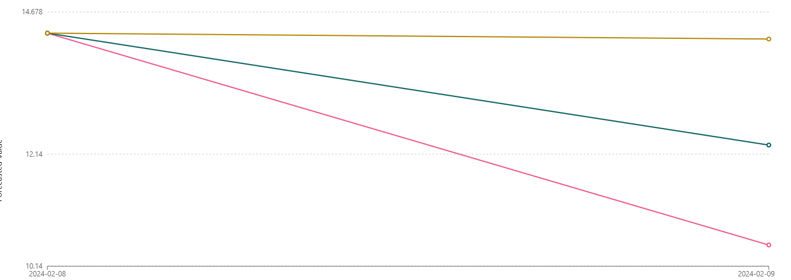
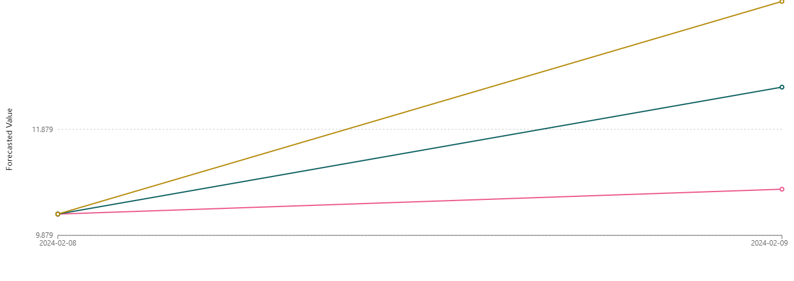

# 📊 Previsão de Estoque Inteligente na AWS com [SageMaker Canvas](https://aws.amazon.com/pt/sagemaker/canvas/)

Bem-vindo ao desafio de projeto "Previsão de Estoque Inteligente na AWS com SageMaker Canvas. Neste Lab DIO, você aprenderá a usar o SageMaker Canvas para criar previsões de estoque baseadas em Machine Learning (ML). Siga os passos abaixo para completar o desafio!

## 📋 Pré-requisitos

Antes de começar, certifique-se de ter uma conta na AWS. Se precisar de ajuda para criar sua conta, confira nosso repositório [AWS Cloud Quickstart](https://github.com/digitalinnovationone/aws-cloud-quickstart).

## 🎯 Objetivos Deste Desafio de Projeto (Lab)

- Dê um fork neste projeto e reescreva este `README.md`. Sinta-se à vontade para detalhar todo o processo de criação do seu Modelo de ML para uma "Previsão de Estoque Inteligente".
- Para isso, siga o [passo a passo] descrito a seguir e evolua as suas habilidades em ML no-code com o Amazon SageMaker Canvas.
- Ao concluir, envie a URL do seu repositório com a solução na plataforma da DIO.

## 🚀 Passo a Passo

### 1. Selecionar Dataset
O modelo utilizado foi: dataset-1000-com-preco-variavel-e-renovacao-estoque

### 2. Construir/Treinar
A coluna selecionada para ser prevista foi PRECO e os itens foram identificados pelo ID_PRODUTO.

### 3. Analisar

-   Avg. wQL (Average Weighted Quantile Loss):
A métrica de perda quantílica ponderada média mede a diferença entre as quantis previstas e os valores reais observados.

-   MAPE (Mean Absolute Percentage Error):
 O MAPE é a média das diferenças absolutas entre os valores previstos e os valores reais, expressas como uma porcentagem dos valores reais.
Significado: Um MAPE de 0.111 significa que, em média, as previsões do modelo estão a 11.1% de erro dos valores reais.

-  WAPE (Weighted Absolute Percentage Error):
 O WAPE é uma métrica que calcula a soma dos erros absolutos, ponderados pela soma dos valores reais. É uma variação do MAPE que ajusta a escala dos erros de acordo com os valores reais.
Significado: Um WAPE de 0.108 significa que o erro absoluto ponderado representa 10.8% dos valores reais. Assim como o MAPE, valores menores indicam previsões mais precisas.

-  RMSE (Root Mean Squared Error):
O RMSE é a raiz quadrada da média dos erros quadrados entre as previsões e os valores reais.
Significado: Um RMSE de 1.678 significa que, em média, o desvio padrão das previsões do modelo em relação aos valores reais é 1.678 unidades. Valores menores indicam um modelo com previsões mais precisas.
-  MASE (Mean Absolute Scaled Error):
O MASE é uma métrica de erro que é escalada de forma a ser independente da escala dos dados. Ele compara o erro absoluto médio do modelo com o erro absoluto médio de uma previsão baseada em uma regra simples, como a previsão por média histórica.
Significado: Um MASE de 0.847 indica que o erro absoluto médio do modelo é 84.7% do erro de uma previsão baseada em uma regra simples. Um valor menor que 1 indica que o modelo é melhor que a previsão por média histórica.

### 4. Prever
Só foi possível prever análises no tipo de predição Single Prediction, então foram gerados algumas análises individuais mostradas na imagem abaixo: 

- Historical Demand
É relacionado aos dados de demanda passados. Esses dados representam o histórico de vendas ou uso de um produto ou serviço ao longo do tempo. É importante essa análise para entender padrões e tendências, identificar sazonalidades, e construir modelos de previsão mais precisos. No contexto de séries temporais, a demanda histórica é usada como base para treinar modelos que podem prever demandas futuras.

p10, p50, p90
Os termos p10, p50, e p90 referem-se a pontos específicos de previsões quantílicas, que são usadas para representar a incerteza nas previsões de séries temporais. Essas quantis fornecem intervalos de confiança para as previsões, ajudando a entender a faixa de possíveis valores futuros.

- p10 (10th Percentile):
Representa o valor abaixo do qual 10% das previsões são esperadas cair. Fornece um limite inferior, indicando que há uma baixa probabilidade (10%) de que a demanda real será menor do que este valor. É útil para planejamento em cenários conservadores.

- p50 (50th Percentile or Median):
É o valor mediano da previsão. Metade das previsões são esperadas estar acima deste valor e metade abaixo. é usado como a previsão central, oferecendo o valor mais provável. Ele serve como uma estimativa de ponto que equilibra o risco de subestimação e superestimação.
- p90 (90th Percentile):
Representa o valor abaixo do qual 90% das previsões são esperadas cair. Fornece um limite superior, indicando que há uma alta probabilidade (90%) de que a demanda real será menor do que este valor. É útil para planejamento em cenários otimistas.

